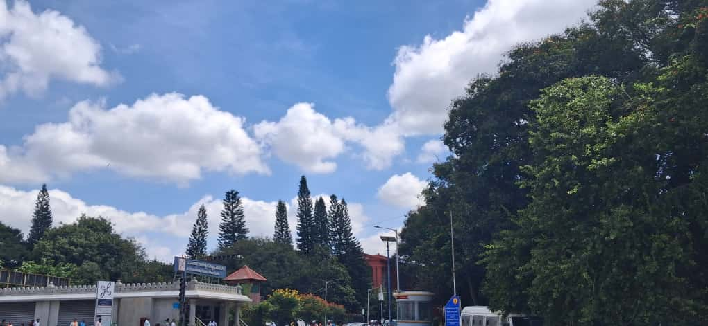
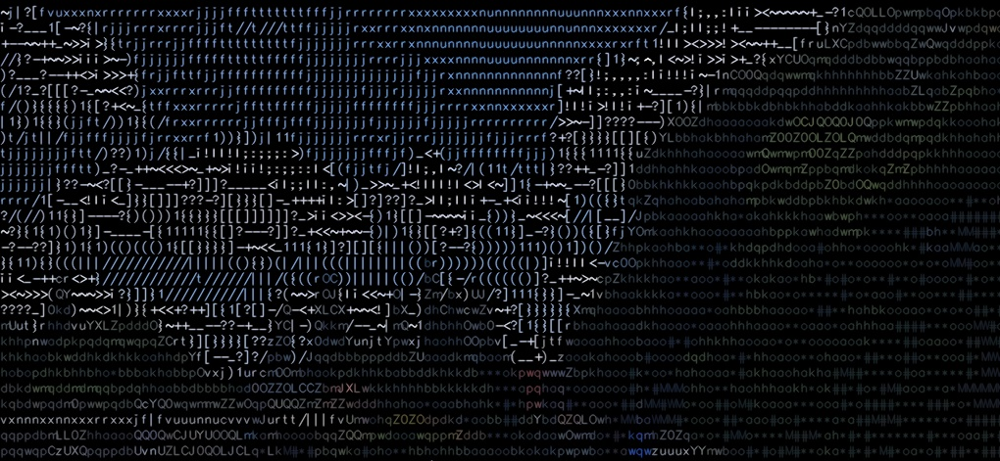
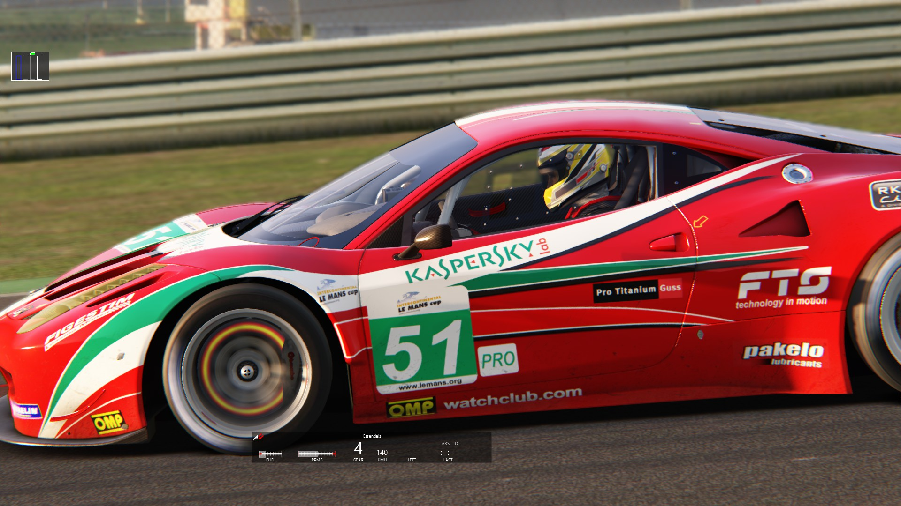
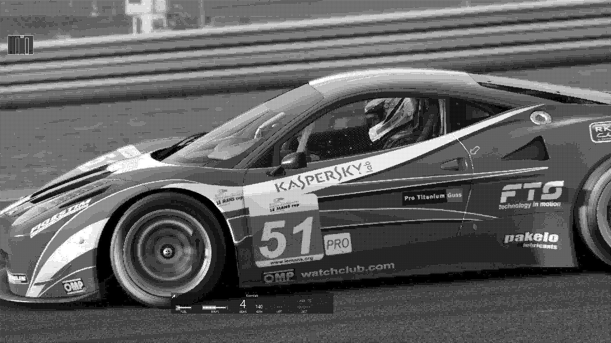

# 🎨 Visual Effects

A collection of Python-based image processing visual effects built with **OpenCV** and **NumPy**. Each effect transforms an ordinary photograph into a stylized visual output.

---

## 📦 Requirements

```bash
pip install opencv-python numpy
```

---

## 🔤 1. ASCII Art

> **`ascii_art/ascii_art.py`** — Converts an image into a **colored ASCII character rendering**.

### How It Works

1. The image is divided into small blocks (`8×16` pixels each).
2. The **average brightness** of each block is computed using the luminance formula:
   ```
   brightness = 0.299·R + 0.587·G + 0.114·B
   ```
3. The brightness is mapped to a character from a density ramp:
   ```
   $@B%8&WM#*oahkbdpqwmZO0QLCJUYXzcvunxrjft/|()1{}[]?-_+~<>i!lI;:,^.
   ```
4. Each character is drawn in the **original average color** of its block, producing a color ASCII image.

### Parameters

| Parameter   | Default | Description                          |
|-------------|---------|--------------------------------------|
| `scale`     | `1.0`   | Resize factor before processing      |
| `block_w`   | `8`     | Block width (pixels)                 |
| `block_h`   | `16`    | Block height (pixels)                |
| `font_scale`| `0.4`   | Font size for ASCII characters       |

### Before & After

<table>
  <tr>
    <th>🖼️ Before (Original)</th>
    <th>🔤 After (ASCII Art)</th>
  </tr>
  <tr>
    <td></td>
    <td></td>
  </tr>
</table>

### Usage

```bash
cd ascii_art
python ascii_art.py
```

---

## 🔲 2. Ordered Dithering

> **`dithering_images/dither_img.py`** — Applies **ordered (Bayer) dithering** to produce a stylized black-and-white halftone effect.

### How It Works

1. The input image is converted to **grayscale**.
2. A **4×4 Bayer matrix** is tiled across the entire image to create a threshold map:
   ```
   ┌─────────────────┐
   │  0   8   2  10  │
   │ 12   4  14   6  │
   │  3  11   1   9  │
   │ 15   7  13   5  │
   └─────────────────┘
   ```
3. Each pixel is compared against the threshold map — if brighter than the threshold, it becomes **white (255)**; otherwise, **black (0)**.
4. The result is a crisp, retro-style dithered image reminiscent of early computer graphics.

### Parameters

| Parameter      | Default       | Description                             |
|----------------|---------------|-----------------------------------------|
| `INPUT_FILE`   | `"f40 5.jpg"` | Path to the input image                 |
| `OUTPUT_FILE`  | `"out_67.jpg"` | Path for the output dithered image     |
| `RESIZE`       | `None`        | Optional resize dimensions              |
| `BAYER`        | 4×4 matrix    | The Bayer threshold matrix              |

### Before & After

<table>
  <tr>
    <th>🖼️ Before (Original)</th>
    <th>🔲 After (Dithered)</th>
  </tr>
  <tr>
    <td></td>
    <td></td>
  </tr>
</table>

### Usage

```bash
cd dithering_images
python dither_img.py
```

---

## 📁 Project Structure

```
visual-effects/
├── README.md
├── ascii_art/
│   ├── ascii_art.py       # ASCII art conversion script
│   ├── test.jpg           # Input image
│   └── outside.jpg        # Output — ASCII-rendered image
└── dithering_images/
    ├── dither_img.py       # Ordered dithering script
    ├── 244210_123.jpg      # Input image (Ferrari F40)
    └── out_2.jpg           # Output — dithered B&W image
```

---

## 🚀 Adding Your Own Images

1. Place your image in the appropriate effect folder.
2. Update the input filename in the script:
   - **ASCII Art**: Change `img = cv.imread('your_image.jpg')` in `ascii_art.py`
   - **Dithering**: Change `INPUT_FILE = "your_image.jpg"` in `dither_img.py`
3. Run the script and check the output!

---

## 📜 License

This project is open source — feel free to use, modify, and share.
